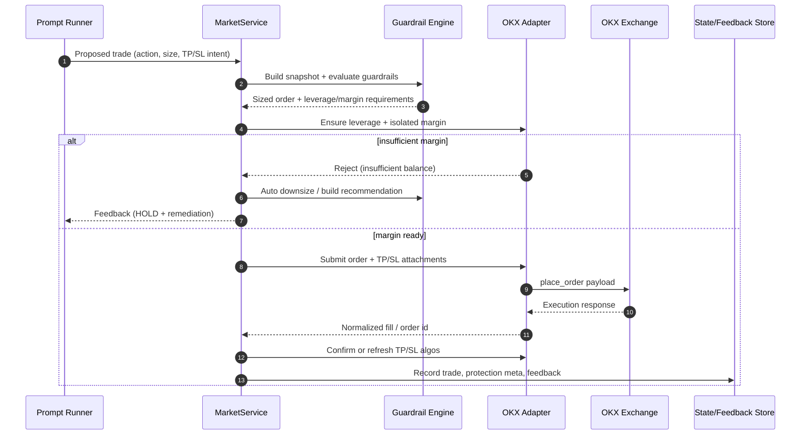

# Trading Guardrails Overview

This guide explains the guardrail system in plain language so new operators can see how sizing, leverage, and safety valves interact. Every guardrail operates on the throttle trades down before the exchange rejects them principle.

---

## Market Service Flow (UML)



The diagram shows how MarketService mediates between prompt decisions and OKX. Every trade first flows through guardrail sizing, then optional leverage/margin prep. Failures generate downsizing guidance before any retry, while successful orders immediately sync TP/SL algos and persist execution evidence so future prompts inherit up-to-date context.

## 1. Account-Level Limits

```
Total Equity (100%)
│
├─ Global Max Position % (e.g. 80%)
│   └─ Defines how much notional the entire strategy may use at once.
│
└─ Daily Loss Limit (e.g. 5%)
    └─ If equity drops past this % within 24h, all prompts + trades halt.
```

- **Global Max Position %** multiplies equity by max leverage to set a hard budget. If set to 0.8, the system clips combined exposure to 80% of equity before leverage.
- **Daily Loss Limit** watches trailing equity history (24h window). Breach ⇒ prompt scheduler returns 423 (locked) and execution ignores decisions until equity recovers.

---

## 2. Per-Symbol Caps

```
Global Cap (80%)
│
├─ BTC cap 0.20 → takes at most 20% of equity
├─ ETH cap 0.15 → at most 15%
└─ Micro cap 0.05 → at most 5%
```

- Use these knobs to *share* capital across pairs. The execution layer clips an order to the **minimum** of global cap, per-symbol cap, and exchange margin.
- Typical workflow: keep the global cap generous (70–80%) and assign smaller caps per instrument so one trade cannot starve the rest.

---

## 3. Leverage Envelope

```
Min Leverage ─┐
              ├─ _compute_leverage_adjusted_size()
Max Leverage ─┘
          ▲
          └─ Confidence Gate (e.g. 0.6) decides how far toward max leverage a trade may stretch.
```

- **Min Leverage** forces a floor; the execution layer scales the LLMs size hint up if necessary. Lower this value to keep low-conviction trades small.
- **Max Leverage** forms the ceiling; clip orders above this before reaching the exchange.
- **Confidence Gate** (0–1) means: only lean into leverage when confidence beats the gate. Below the gate, trades stay near the minimum.

---

## 4. Cooldowns & Churn Control

```
Trade → Cooldown timer ─┐
                        ├─ blocks duplicate signals during hold period
Max trades/hour ────────┘
```

- **Min Hold Seconds**: after one trade in a symbol, force a waiting period before the next order.
- **Max Trades Per Hour**: absolute cap on how many executions each symbol can perform in a rolling window.
- These settings are per symbol, so one active market does not silence the rest.

---

## 5. Margin Health Checks

```
Available Margin from OKX
│
├─ Guardrail cap
├─ Tier (exchange) cap
└─ Symbol cap
      ↓ lowest wins → final order size
```

- Every prompt includes `context.execution.margin_health` summarizing available USDT, tier limits, and the smallest active cap.
- If OKX returns errors like `51008`, the feedback is cached and the LLM is instructed to HOLD until the operator tops up margin or reduces other positions.
- **Execution Feedback TTL** controls how long those warnings stay sticky; lower the value (or set to 0) when you want blockers to auto-expire quickly once conditions improve.
- TP/SL guardrails now nudge invalid targets instead of dropping them; protections are shifted by at least `max(tick_size, 0.1% of entry)` so they stay on the correct side while the adjustment is logged for visibility.
- Venue-specific order caps are enforced automatically: if a market/limit instruction exceeds OKX `maxMktSz`/`maxLmtSz`, the size is clipped to the allowed maximum and logged before the order is sent.

### Auto-Seeding Isolated Margin

- When OKX rejects an isolated top-up with `59300` (insufficient balance), the engine now attempts a one-shot transfer from **Funding → Trading** before retrying the adjustment.
- Two guardrail knobs control this behavior:
    - `isolated_margin_seed_usd` / per-symbol overrides define the maximum USDT that may be moved for each symbol.
    - `isolated_margin_max_transfer_usd` caps every transfer regardless of symbol.
- Transfers only trigger in isolated mode, require a configured quote currency (e.g., USDT), and respect Funding balances—if the wallet is empty or limits are too low, the trade is blocked and a warning is recorded.
- Configure these values in **CFG → Execution Guardrails → Isolated Margin Auto-Seed** to keep isolated buckets topped off without logging into OKX.

---

## 6. Risk Locks Recap

| Lock            | Trigger                                     | Effect                              |
|-----------------|---------------------------------------------|-------------------------------------|
| Daily Loss      | Equity drawdown beyond configured % / 24h   | Scheduler + execution halt          |
| Margin Feedback | Latest OKX response reports insufficient USDT | LLM decisions default to HOLD       |
| Wait-for-TP/SL  | Position already has synced TP/SL orders    | Prevents exits until protection fills|

---

## 7. Quick Tuning Checklist

1. **Set per-symbol caps** summing to the amount of equity you want deployed simultaneously.
2. **Lower min leverage** (or raise the confidence gate) so low-confidence calls stay tiny instead of scaling to the floor.
3. **Monitor margin health** in the UI; top up cross margin before the new trades are attempted.
4. **Keep an eye on `GUARDRAILS.md`** (this file!) whenever onboarding teammates—they can follow the diagrams to see how caps layer together.

With these layers in place, the LLM can focus on signal quality while the execution layer silently shrinks orders to whatever the venue and your policies allow.
